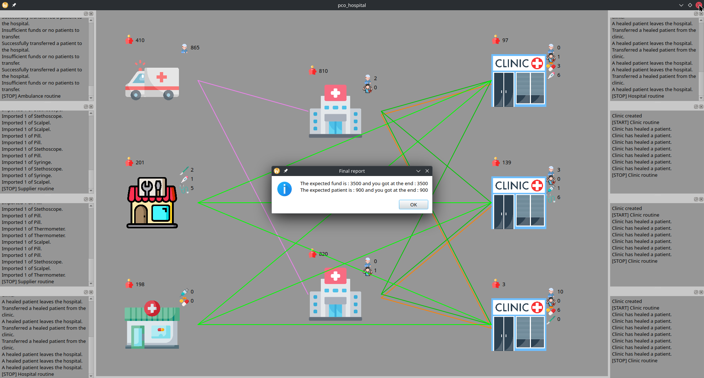

# Gestion d'accès concurrents

Auteurs: Koestli Camille, Nicolet Victor

## Description des fonctionnalités du logiciel

Ce projet consiste à implémenter un système hospitalier devant gérer le flux de patients et les besoins en `stock`. Il inclut différents acteurs : les ambulances, les cliniques spécialisées, les hôpitaux et les fournisseurs de matériel médical.

Chaque acteur est exécuté en tant que thread et doit interagir avec les autres pour assurer une gestion efficace des `stock` et des patients.

## Choix d'implémentation

Le premier élément important à comprendre est que les `stock` et les patients ne peuvent être uniquement modifiés que par leur propriétaire, car ce sont des attributs privés. L'accès concurrent à ces variables est causé par les multiples entités dans différents threads qui demandent une transaction en parallèle. La transaction (lecture et modification des `money` et des `stock`) doit être effectuée de manière atomique, c'est pourquoi nous avons utilisé un mutex par entité.

### Mutex

Nous avons implémenté un mutex dans la classe `Seller`, qui fournit à chaque sous-classe son propre mutex exclusif. Pour simplifier notre implémentation et améliorer les performances, nous avons opté pour un seul mutex pour protéger les deux variables. Ce mutex est acquis lorsque nous lisons ou modifions `money` ou les `stock`, puis est libéré une fois les opérations terminées.

De plus, pour éviter de perdre du temps, nous avons mis en dehors de nos sections critiques `interface->simulatework()`.

- Transactions entre acteurs : Chaque fois qu’un transfert de patient ou de `stock` a lieu, la section critique met à jour les stocks et `money`.
- Accès aux `stock` de chaque thread : Lorsque les stocks ou `money` sont modifiés, un mutex assure que seule une ambulance ou une clinique à la fois peut réaliser cette opération.

### Clinic

La Clinic est responsable de traiter les patients malades en fonction des `stock` et de les commander en cas de besoin.

`Clinic::request`

- Cette méthode permet à d’autres entités de demander des patients sains. La clinique vérifie que le type de patient demandé est bien `PatientHealed` et retourne la quantité demandée pour effectuer le transfert.
- Si les conditions sont remplies, la clinique met à jour son stock et ses `money`, et retourne 1 pour indiquer que la demande est ok. Sinon, la méthode retourne 0.
- La section critique est protégée par un mutex pour garantir une modification sûre des `stock` et des `money` en cas d’accès concurrent.

`Clinic::treatPatient()`

- Cette méthode traite un patient malade pour le transformer en patient guéri, mais seulement si les `stock` nécessaires sont disponibles (vérifiées par `verifyResources()`).
- En cas de succès du traitement, le stock de `PatientHealed` est augmenté et celui de `PatientSick` est décrémenté. Le traitement est simulé par un appel à `interface->simulateWork()` qui représente le temps requis pour soigner un patient.
- Dans cette méthode, un mutex protège la modification des stocks et des `money`, pour éviter les conflits de concurrence.

`Clinic::orderResources()`

- La clinique commande des `stock` aux fournisseurs en cas de besoin. Si des `stock` nécessaires sont épuisées et que `money` sont suffisants, les `stock` manquantes, comme Pill, Scalpel, et Syringe, sont commandées chez un fournisseurs aléatoires, et les patients malades peuvent être demandés aux hôpitaux.
- La section critique est protégée par un mutex pour garantir que les modifications des stocks et des `money` se font sans interférence.

`Clinic::run()`

- La méthode `run()` est la boucle principale de la clinique, qui vérifie constamment si elle dispose de suffisamment de `stock` pour traiter un patient. Si les `stock` sont disponibles, elle appelle `treatPatient()`. Sinon, elle appelle `orderResources()` pour approvisionner les stocks.
- La boucle continue tant que `stopRequest` est `false`, ce qui permet d’arrêter proprement la simulation lorsque le signal est émis.

### Ambulance

L’Ambulance est chargée de transporter les patients malades vers les hôpitaux.

`Ambulance::sendPatient()`

- Cette méthode sélectionne un hôpital au hasard parmi ceux disponibles et tente de transférer un patient malade. Avant, elle vérifie si l'hôpital a la capacité d’accueillir un nouveau patient et si le montant de la transaction peut être payé.
- Si le transfert est possible, le nombre de patients dans l’ambulance est décrémenté et `money` sont mis à jour.
- La méthode utilise un mutex pour sécuriser les modifications des attributs `money`, `stock`, et `nbTransfer`.

`Ambulance::run()`

- Cette méthode est la boucle principale de l'ambulance, qui continue à exécuter la routine de transfert de patients tant que la variable `stopRequest` n’est pas activée.
- La méthode vérifie d’abord s’il y a des patients malades dans le stock de l’ambulance. Si oui, elle appelle `sendPatient()` pour tenter un transfert.

### Hospital

La classe `Hospital` gère les patients malades et soignés. Elle les reçoit depuis des ambulances ou des cliniques et en les libère après une période d'hospitalisation.

`Hospital::freeHealedPatient()`

- Cette méthode vérifie les patients guéris hospitalisé pour voir s'ils sont prêts à être libérés.
- Elle utilise un `std::deque<int>` healedPatientsDaysLeft, où chaque élément représente le nombre de jours de récupération restants pour un patient guéri. Lorsque le compteur atteint zéro, le patient est libéré, le nombre de lits occupés est décrémenté, et le stock de `PatientHealed` est mis à jour.
- Un mutex est utilisé pour protéger l'accès à `healedPatientsDaysLeft`et aux autres variables partagées.

`Hospital::transferPatientsFromClinic()`

- Cette méthode transfère un patient guéri depuis une clinique vers l'hôpital. Elle choisit aléatoirement une clinique parmi celles disponibles.
- Si la clinique répond ok et que l’hôpital possède suffisamment d'argent et de lits, le transfert est fait, `money` sont mis à jour, et le patient est ajouté avec une période d'hospitalisation de 5 jours, représentée par l'ajout de 5 dans `healedPatientsDaysLeft`.
- Cette méthode utilise un mutex pour permettre la sécurité des modifications sur les `stock` partagées.

`Hospital::send`

- La méthode `send` transfère un patient vers un autre hôpital ou une clinique.
- Avant le transfert, elle vérifie que l’hôpital dispose d’un nombre suffisant de lits et de `money` pour la transaction. Si c'est bon, les stocks de l’hôpital et ses `money` sont mis à jour.
- Un mutex protège les modifications sur les variables critiques.

`Hospital::run()`

- Cette méthode est la boucle principale qui gère les transferts de patients et les sorties de l'hôpital.
- La boucle continue tant que le signal d'arrêt `stopRequested()` n'est pas réalisé. Pendant l’exécution, `transferPatientsFromClinic()` est appelée pour gérer les transferts de patients depuis la clinique, et `freeHealedPatient()` va les libérer après leur hospitalisation.

### Supplier

`Supplier::request`

- Cette méthode permet aux entités, comme les cliniques, de demander une certaine quantité d'une `stock` au fournisseur.
- Si le stock de l’item demandé est ok, la transaction est réalisé, `money` du fournisseur sont augmentés et le stock de l’item est décrémenté.
- Un mutex est utilisé pour protéger l'accès aux stocks et aux `money`.

`Supplier::run()`

- La méthode est la boucle principale du fournisseur, qui gère l’augmentation des stocks et les transactions des payements pour les employés.
- À chaque itération, un item est choisi au hasard dans les stocks, et un coût est appliqué pour simuler un achat.
- Si `money` sont suffisants pour couvrir le salaire de l’employé, le stock de l’item est augmenté. Le processus est simulé avec `simulateWork()` pour ajouter un délai, et `money` et stocks sont mis à jour dans l’interface.

### Fin simulation

Afin d'assurer un arrêt correct de la simulation, nous avons déclaré une variable booléenne appelée `stopRequest` dans le fichier `Utils.cpp`, qui sert de signal pour indiquer si une demande d'arrêt de la simulation a été faite. Cette variable est initialement définie sur `false` et passe à `true` si un appel à `Utils::endService()` est effectué (lorsque la fenêtre est fermée).

Pour en tenir compte dans le reste du projet, nous avons ajouté une boucle `while` qui vérifie si `stopRequest` est `true` dans toutes les fonctions `run` de chaque sous-classe de `Seller`.

Malheureusement, nous avons remarqué que lorsque nous arrivons à la fin de la simulation et qu'il n'y a plus aucune transaction entre les différents acteurs, nous remarquons que notre programme plante. Nous avons pensé qu'il s'agissait d'un interblocage mais nous n'avons pas réussi à résoudre le problème.

## Tests effectués

**Test validé**

Ce test fourni a pour but de valider le bon fonctionnement des transactions et de la gestion des patients dans la classe `Hospital`. En particulier, il vérifie que :

- L’hôpital peut gérer l’envoi et la réception de patients.
- `money` et les stocks sont mis à jour correctement après chaque transaction.
- Le nombre de lits occupés ne dépasse pas la capacité maximale de l’hôpital.

## Conclusion

Notre objectif principal était de gérer efficacement la concurrence dans notre application de simulation d'un hôpital et de ventes dynamiques. Pour y parvenir, nous avons créé un système fiable afin de protéger les `stock` cruciales dans un environnement multi-thread en plaçant stratégiquement plusieurs mutex autour des sections critiques du code.

Ce système garantit que chaque entité a un accès exclusif à ses `stock` essentielles, évitant ainsi les conflits et assurant la cohérence des données. Notre approche met également l’accent sur l’efficacité en minimisant les retards dans l’exécution du programme, en particulier lors de la gestion des fonctions de transaction.
